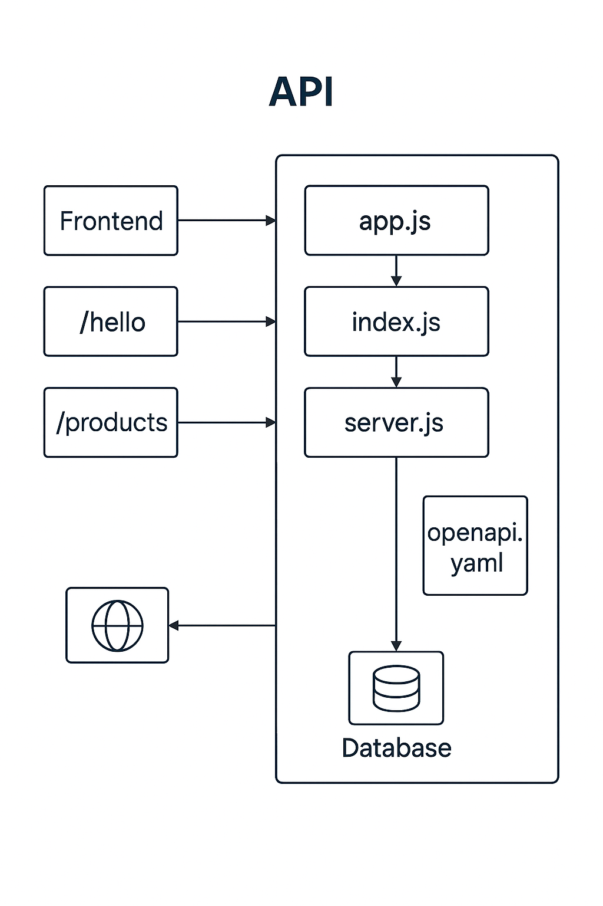

# 🏗️ Documentación Técnica - Arquitectura de APIFIRST

Este documento describe la arquitectura técnica del proyecto **APIFIRST**, una API monolítica construida con **Express.js**.

---

## 📦 Estructura General

La aplicación está compuesta por los siguientes archivos principales:

- `index.js`: Punto de entrada de la aplicación.
- `app.js`: Contiene toda la lógica de la API, incluyendo definición de endpoints y middlewares.
- `server.js`: Inicializa el servidor HTTP.
- `openapi.yaml`: Define la especificación OpenAPI para la documentación.
- `test.js`: Pruebas automatizadas con Jest y Supertest.

---

## 🔁 Flujo de Ejecución

1. `index.js` importa `app.js` y lo pasa a `server.js`.
2. `server.js` inicia el servidor Express en el puerto definido.
3. `app.js` define los endpoints (`/hello`, `/users`, `/products`) y configura middlewares.
4. La documentación Swagger se genera automáticamente desde `openapi.yaml`.
5. Las pruebas se ejecutan con `npm test` usando Jest y Supertest.

---

## 🧱 Justificación de Arquitectura

Aunque se menciona el patrón MVC, esta versión de APIFIRST no implementa controladores ni rutas separadas. Toda la lógica está centralizada en `app.js`, lo que simplifica el desarrollo inicial y facilita la comprensión del flujo.

Esta arquitectura es adecuada para:
- Proyectos pequeños.
- Prototipos rápidos.
- APIs con bajo nivel de complejidad.

---

## 🗂️ Diagrama de Arquitectura

El siguiente diagrama representa visualmente la arquitectura del sistema:


---

## 📚 Documentación OpenAPI

La documentación de la API está disponible en:

```
http://localhost:3000/docs
```

Generada automáticamente desde `openapi.yaml`.

---

## 🧪 Pruebas

Las pruebas están escritas con **Jest** y **Supertest**. Se ejecutan con:

```bash
npm test
```

---

## 📌 Conclusión

Esta arquitectura permite una implementación rápida y funcional de una API RESTful. A medida que el proyecto crezca, se recomienda modularizar la lógica en controladores y rutas para mejorar la mantenibilidad.
